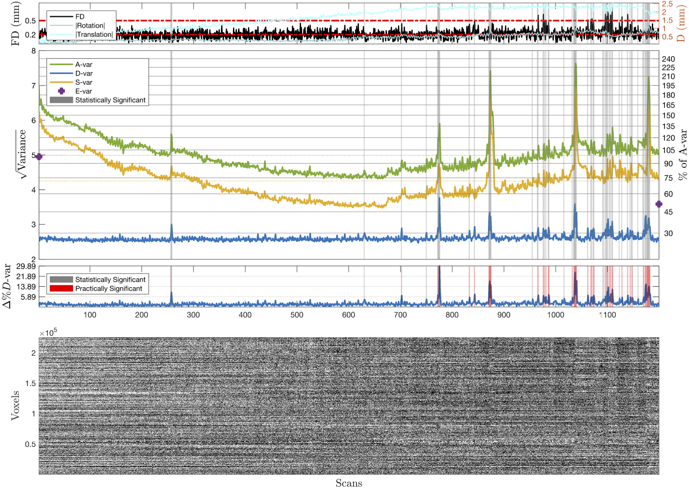

# Introduction

Series of scripts, mainly in MATLAB and BASH, to support DVARS inference and DSE variance decomposition proposed in

 __Afyouni S. & Nichols T.E, *Insight and Inference for DVARS*, 2017__
http://www.biorxiv.org/content/early/2017/04/06/125021.1

The toolbox can be used to:

* generate DVARS and five standardised variants of the measure.
* generate p-values for spikes to facilitate the decision whether a spike is corrupted and should be scrubbed.
* explain variance of 4D fMRI images via three variance components: fast (D-var), slow (S-var) and edge (E-var).
* explain what share of the whole variance each component occupies.

All materials presented in Afyouni&Nichols (2017) can be reproduced using codes presented in [DVARS_Paper17](https://github.com/asoroosh/DVARS_Paper17).

# Configuration

## Dependencies
* `MATLAB2013b` (or later) statistical toolbox [required].
* `'/Nifti_Util'` for neuroimaging analysis. This folder contains selective function from  [optional].
* `FSL 5.0.9` (or later) to produce DSE variance images [optional].

# fMRI Diagnostics
Here we show the proposed diagnostic figure and table can be used to examine the quality of the fMRI datasets. We start with basic example, on minimally pre-processed HCP subject 115320, which can be used to perform _DVARS inference_, _DSE variance decomposition_ and eventually _fMRI diagnostic_.

Firstly, load an fMRI image into your Matlab using `Nifti_Util` tool (or any other external toolbox) available.

```
Path_to_Nifti='~/your/nifti/file/118730/rfMRI_REST1_LR.nii.gz';
V1 = load_untouch_nii(Path_to_Nifti);
V2 = V1.img;
X0 = size(V2,1); Y0 = size(V2,2); Z0 = size(V2,3); T0 = size(V2,4);
I0 = prod([X0,Y0,Z0]);
Y  = reshape(V2,[I0,T0]); clear V2 V1;
```

## DVARS Inference
`DVARSCalc.m` allows you to estimate the DVARS-related statistics (e.g. D-var, p-values for spikes and standardised variants of the fast variance including Δ%D-var for practical significance).

```
[DVARS,DVARS_Stat]=DVARSCalc(Y,'scale',1/100,'TransPower',1/3,'RDVARS','verbose',1);
```
For detailed description of each input argument, type `help DVARSCalc`. DVARSCalc prints out a log as

```
-Input is a Matrix.
-Extra-cranial areas removed: 224998x1200
-Intensity Scaled by 0.01.
-Data centred. Untouched Grand Mean: 9999.2939, Post-norm Grand Mean: 99.9927
-Robust estimate of autocorrelation...
--voxel: 100000
--voxel: 200000
--AC robust estimate was failed on 1 voxels.
-Settings:
--Test Method:          X2
--ExpVal method:        median
--VarEst method:        hIQRd
--Power Transformation: 0.33333

Settings: TestMethod=X2  I=224998  T=1200
----Expected Values----------------------------------
    sig2bar    sig2median    median    sigbar2     xbar
    _______    __________    ______    _______    ______

    26.577     19.723        26.488    23.095     27.028

----Variances----------------------------------------
      S2       IQRd      hIQRd
    ______    ______    _______

    6.1229    1.1031    0.84496
```
which includes Variance and Expected Values tables shows the results of different methods of estimating the first two moments discussed in Afyouni & Nichols (2017). For mass analysis you can turn off the log by `...,verbose,0,...`.

`DVARS_Stat` is a structure containing test statistics and standardised D-var measures. For example, use `DVARS_Stat.RDVARS` for Relative DVARS or `Stat.DeltapDvar` for Δ%D-var.


## DSE Variance Decomposition
Using `DSEvars.m` decomposes the image variance (A-var) into three components; fast (D), slow (S) and edge (E) variance.
 ```
[V,DSE_Stat]=DSEvars(Y,'scale',1/100);
 ```
For detailed description of each input argument, type `help DSEvars`. DSEvars prints out a log as:
 ```
 -Input is a Matrix.
 -Extra-cranial areas removed: 224998x1200
 -Intensity Scaled by 0.01.
 -Data centred. Untouched Grand Mean: 9999.2939, Post-norm Grand Mean: 99.9927, Post demean: 1.9908e-07
 -Variance images will NOT be saved:
 -- Either destination directory was not set OR the input is not a nifti.
 ----------------------
 Sum-of-Mean-Squared (SMS) Table
                   Avar     Dvar    Svar     Evar
                   _____    ____    _____    ____

     Whole         30188    8101    22049    37  
     Global          206       4      199     1  
     non-Global    29981    8096    21849    35  

 ------------DSE ANOVA Table
                  MS          RMS       Percentage_of_whole    Relative_to_iid
               _________    ________    ___________________    _______________

     Avar         25.157      5.0157          100                    1        
     Dvar         6.7514      2.5984       26.837              0.53719        
     Svar         18.374      4.2865       73.039                1.462        
     Evar       0.031147     0.17648      0.12381               1.4857        
     g_Avar      0.17212     0.41487      0.68418               1539.4        
     g_Dvar     0.003973    0.063032     0.015793               71.126        
     g_Svar       0.1665     0.40805      0.66185               2980.8        
     g_Evar    0.0016433    0.040538    0.0065323                17637        

 ----------------------
 ```
 Which includes the DSE ANOVA table. Similarly, log can be turned off by `...,verbose,0,...`.

 `V` is a structure containing all the variance components and `DSE_Stat` is a structure containing columns of the ANOVA table as well as Δ%D-var.  

## Visualisation
We suggest to summarise all the results via a simple visualisation of the DSE variance components and significant DVARS data-points
as proposed in paper (see Fig. 3, Fig. 4 and Fig. 5). Using `V` and `DVARS_Stat`, this can easily be done as below:

```
fMRIDiag_plot(V,DVARS_Stat)
```

Although by passing more input arguments, a richer diagnostic figure can be produced. For example, to add the BOLD intensity image, you can use

```
fMRIDiag_plot(V,DVARS_Stat,'BOLD',Y)
```

and also, the displacement information, such as Frame-wise Displacement (FD), can be added to the this figure.

```
%--Movement Parameters--------------------------------
%replace this path with the path to the text files with movement regressors
%of the image on your machine
%Note that MovPartextImport only works safe with the HCP files, you have to
%insert the movement regressors mannually (just drag the text file into the
%workspace!) to the Matlab.

MovPar=MovPartextImport(['~/115320/MNINonLinear/Results/rfMRI_REST1_LR/Movement_Regressors.txt']);
[FDts,FD_Stat]=FDCalc(MovPar);
%--------------------------------

fMRIDiag_plot(V,DVARS_Stat,'BOLD',Y,'FD',FDts,'AbsMov',[FD_Stat.AbsRot FD_Stat.AbsTrans])
```

